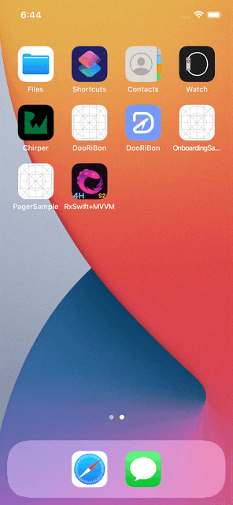

# Onboarding Sample

```
온보딩 화면에 대한 샘플 코드입니다.
```

- 스토리보드를 이용했고, 셀의 경우 xib로 만들었습니다.
- 전체적인 틀은 컬렉션뷰(CollectionView)와 페이지 컨트롤(Page Control)을 이용해서 구현을 했습니다.
- `lottie` 라이브러리를 이용해서 animation json 파일을 띄웠습니다.
- didSet 프로퍼티 관찰자를 이용해서 마지막 온보딩 페이지에 도달 시 버튼의 타이틀을 변경해주었습니다.

<br />

## Preview



<br />

## More

- 셀이 바뀔때마다 애니메이션이 완전히 새로 시작하도록 처리를 해야 합니다. (방법 고민중)
- `skip` 버튼을 눌렀을 때의 처리를 해야합니다.
- `Start` 버튼을 눌렀을 때 메인화면으로 전환되어야 합니다.
